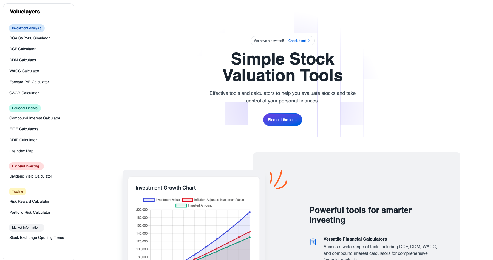
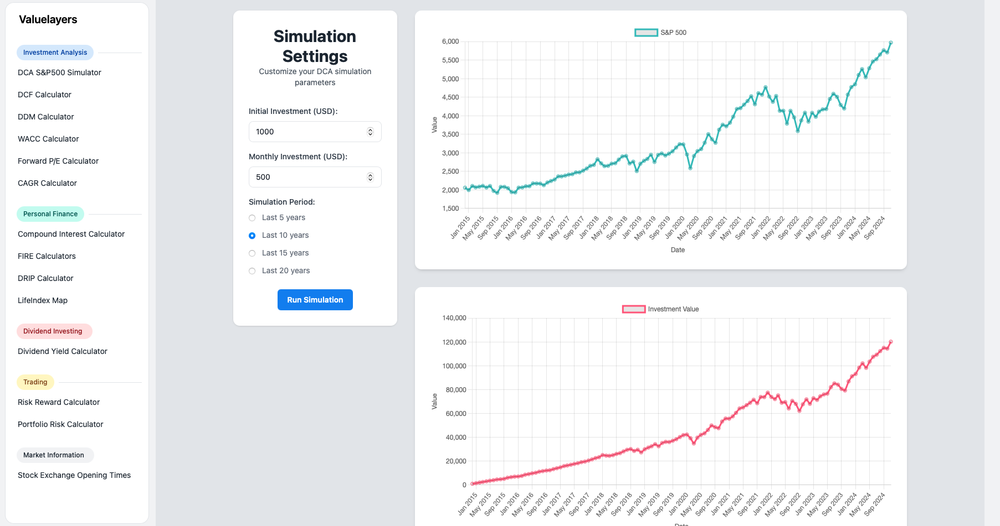

> ⚠️ This project was created as a hobby project. The results have not been fully validated and may contain errors. Community help and contributions are highly appreciated.
# Valuelayers — simple open source tools for asset valuation

Valuelayers provides practical calculators and tools for investment analysis, personal finance, and risk assessment. The goal is to make the code accessible, encourage community contributions, and build a modular set of tools.

## What the project includes

Each calculator is treated as an independent module. Every module is a standalone web page with a simple user interface and clear calculation logic. The first modules include a DCF calculator, DDM calculator, WACC, a DCA simulator for the S&P500, and personal finance calculators such as compound interest and FIRE scenarios.

## Technology and structure

The project is designed to be as simple to deploy as possible. We assume a static website powered by JavaScript.

## How to run locally

The project consists of plain HTML, CSS, and JS.

## How to contribute

We welcome bugfix PRs, new calculators, translations, and UX improvements. If you want to add a new tool, create a folder following the existing template and add a description of the inputs, calculation method, and expected output. For example, in the case of a DCF calculator, specify how to enter free cash flows, the discount rate, and the horizon value.

## Testing and validation of results

Calculations are critical. Each module should include unit tests, example calculations, and at least two cases with control values.

> ⚠️ This project was created as a hobby project. The results have not been fully validated and may contain errors. Community help and contributions are highly appreciated.
